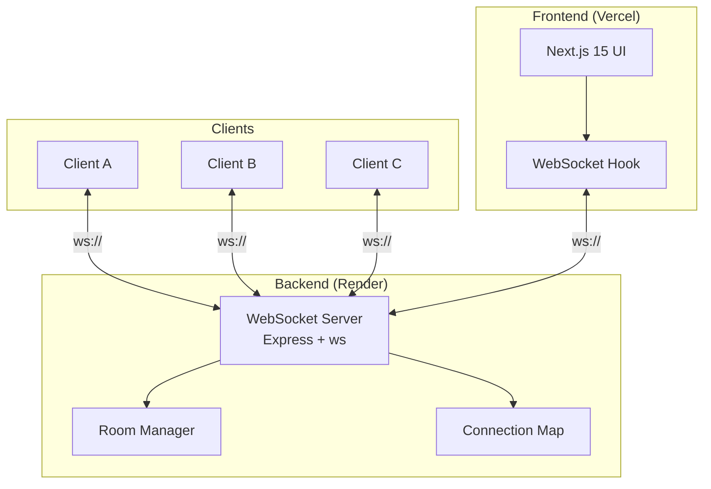

# Realtime Chat — WebSocket Messaging

[](https://www.typescriptlang.org/)
[](https://nextjs.org/)
[](https://tailwindcss.com/)
[](https://developer.mozilla.org/en-US/docs/Web/API/WebSocket)

A real-time messaging application with room-based chat, connect/disconnect controls, and a clean modular monorepo architecture. Built from scratch using raw WebSocket protocol (`ws`) — no Socket.io abstraction.

**[Live Demo](https://realtime-chat-app-seven-eta.vercel.app/)**

---

## Why Raw WebSockets (Not Socket.io)

Most tutorials use Socket.io, which abstracts away the protocol. This project uses the raw `ws` library to understand what's actually happening:

| | Socket.io | Raw `ws` (this project) |
|---|-----------|-------------------------|
| Auto-reconnection | Built-in | Implemented manually |
| Room management | Built-in | Implemented manually |
| Fallback transport | Polling fallback | WebSocket only |
| Understanding | Abstracted | Full protocol control |

> Building with `ws` forced me to handle **connection lifecycle, room broadcasting, and error recovery** from scratch — the same problems you'd solve at scale.

## Architecture



```
realtime-chat-app/
├── backend-ws/              # WebSocket server
│   ├── src/index.ts         # Express + WS server, room logic, message broadcasting
│   ├── package.json
│   └── tsconfig.json
├── frontend-ws/             # Next.js client
│   ├── src/app/             # Pages and API routes
│   ├── src/components/      # Chat UI components
│   └── package.json
└── README.md
```

## Tech Stack

| Layer | Technology | Why |
|-------|-----------|-----|
| WS Server | Node.js, Express, `ws` library | Raw WebSocket control, no abstraction layer |
| Auth | JSON Web Tokens | Stateless authentication for WS connections |
| Frontend | Next.js 15, React, Tailwind v4 | SSR + client-side reactivity |
| Language | TypeScript | Type safety across both packages |
| Deploy | Render (backend) + Vercel (frontend) | Split-stack: WS server needs persistent process |

## Features

- **Room-based messaging** — Create and join topic-based chat rooms
- **Connect/disconnect controls** — Manual connection management from the UI
- **Real-time broadcasting** — Messages delivered instantly to all room members
- **Monorepo structure** — Backend and frontend in one repo with independent configs
- **TypeScript throughout** — Shared types between client and server

## Quick Start

```bash
# Clone
git clone https://github.com/siddgawad/realtime-chat-app.git
cd realtime-chat-app

# Backend
cd backend-ws
npm install
npm run build
npm run start          # Runs on ws://localhost:3003

# Frontend (new terminal)
cd frontend-ws
npm install
npm run dev            # Runs on http://localhost:3000
```

**Environment variables:**
```bash
# backend-ws/.env
PORT=3003

# frontend-ws/.env.local
NEXT_PUBLIC_WS_URL=ws://localhost:3003
```

## What This Demonstrates

- **WebSocket lifecycle** — Connection establishment, heartbeat, reconnection, graceful close
- **Room management** — Server-side room tracking, join/leave broadcasting
- **Message protocol** — Structured JSON messages with type discrimination
- **Monorepo discipline** — Separate packages with independent build configs
- **Split-stack deployment** — WS server on Render (persistent process), UI on Vercel (edge)

## License

MIT
